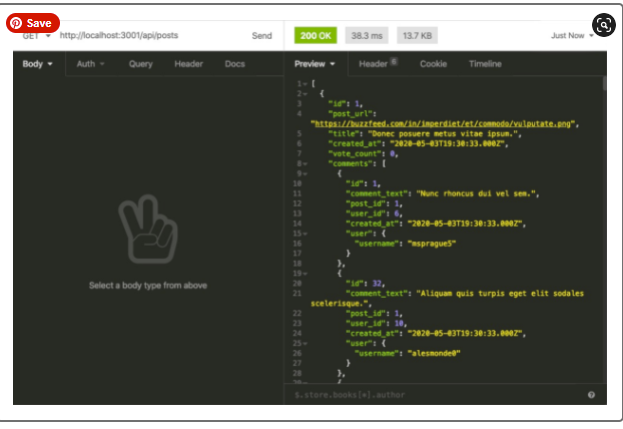

# just-tect-news
Module 13: ORM

## Purpose
Build the back end for my first completely full-stack application, Just Tech News—a tech news website where users can post, upvote, and comment on links to news articles. 
Use Sequelize, an object-relational mapping (ORM) library, to simplify my MySQL queries, add password hashing so that users can create secure passwords, and connect my application to JawsDB, a MySQL add-on for Heroku. 

## Built With
* JawsDB Add-On
* Heroku
* Sequalize
* Dotenv
* bcrypt
* Git Hub

## Contribution
Made with ❤️ by Samantha Malone
Shout out to my tutor
© 2021 Samantha Malone. All rights reserved.
